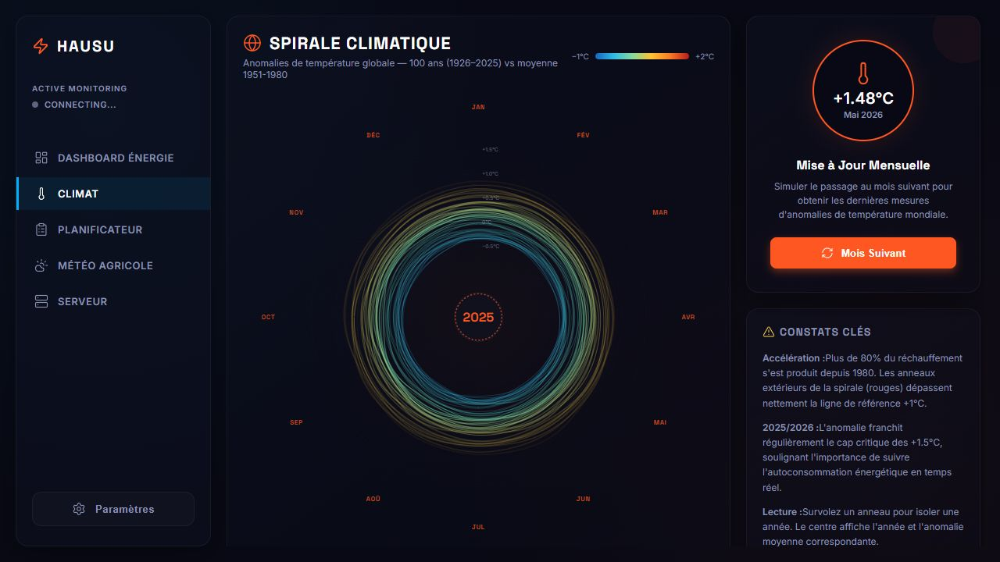
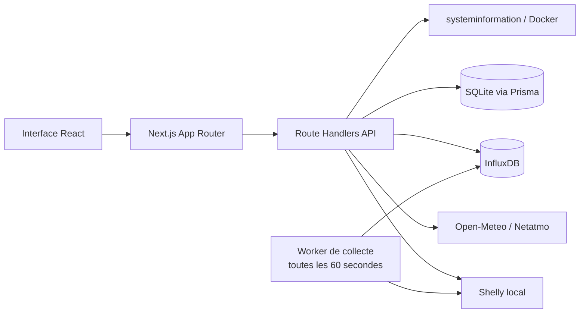

# Hausu

> Un tableau de bord local-first pour comprendre sa maison, son énergie et son environnement.

Hausu est une application web personnelle qui rassemble au même endroit les données d’une installation domestique : consommation électrique en temps réel, production solaire, climat, météo, tâches du quotidien et état du serveur qui l’héberge.

L’objectif est simple : transformer des données techniques dispersées en une interface lisible, utile et agréable à consulter au quotidien.


## Aperçu



L’interface privilégie une lecture rapide des informations : navigation persistante, cartes spécialisées, visualisations lisibles et mise en page adaptée aux écrans desktop comme mobile.

## Ce que le projet démontre

- Concevoir une interface produit complète à partir de besoins concrets.
- Collecter, normaliser et visualiser des données provenant de plusieurs sources.
- Construire une application full-stack moderne avec une API et un worker indépendant.
- Prendre en compte les contraintes d’une installation locale : réseau privé, appareils parfois indisponibles, données de secours et fonctionnement dégradé.
- Tester les parcours principaux et les régressions responsive avec Cypress.

## Fonctionnalités

### Dashboard énergie

- Mesure en direct des trois phases d’un module Shelly EM.
- Distinction entre maison, solaire et chauffe-eau.
- Flux de puissance visualisé et statut de production solaire.
- Historique de consommation sur 1 heure ou 24 heures.
- Recommandations d’utilisation d’appareils en fonction du surplus solaire.

### Climat

- Spirale climatique interactive pour explorer l’évolution des températures.
- Lecture visuelle orientée tendances plutôt que simple affichage de valeurs.

### Météo agricole

- Prévisions à plusieurs jours via Open-Meteo.
- Température, humidité, pression et précipitations provenant d’une station Netatmo lorsque les identifiants sont configurés.
- Coordonnées et nom de ville configurables.
- Données Netatmo mises en cache localement pour conserver un affichage utile en cas d’indisponibilité de l’API.

### Planificateur & actions

- Listes personnalisables, inspirées d’un tableau Kanban.
- Ajout, renommage et suppression de colonnes.
- Création, édition, validation et suppression d’actions.
- Persistance locale via Prisma et SQLite.

### Monitoring serveur

- CPU, température, mémoire, stockage et réseau.
- Détection des conteneurs Docker et affichage de leurs statistiques lorsqu’elles sont disponibles.
- Fallbacks prévus pour les environnements Linux minimalistes où certaines sondes matérielles ne sont pas exposées de manière standard.

### Expérience utilisateur

- Interface responsive desktop et mobile.
- Navigation latérale adaptée aux petits écrans.
- Deux thèmes visuels : classique et inspiré de NieR.
- Mise à jour des données live sans rechargement de la page.

## Architecture



Le navigateur interroge les endpoints Next.js. Un worker séparé collecte périodiquement les mesures du Shelly et les écrit dans InfluxDB ; l’interface peut ensuite consulter ces données historiques sans dépendre d’un appareil disponible à chaque instant.

## Stack technique

| Domaine | Technologies |
| --- | --- |
| Frontend | Next.js 16, React 19, TypeScript, CSS, Recharts, Lucide React |
| Backend | Next.js Route Handlers, worker TypeScript exécuté avec `tsx` |
| Données énergie | Shelly EM, InfluxDB |
| Données applicatives | Prisma, SQLite |
| APIs externes | Open-Meteo, Netatmo |
| Monitoring | `systeminformation`, Docker |
| Qualité | ESLint, Husky, lint-staged, Cypress |

## Installation locale

### Prérequis

- Node.js 20 ou supérieur
- npm
- Un accès réseau au module Shelly pour le dashboard énergie
- InfluxDB pour la collecte et l’historique énergie

### Démarrage

```bash
git clone https://github.com/ChristoCros/Hausu.git
cd Hausu
npm install
cp .env.example .env
npm run dev
```

L’application est ensuite disponible sur [http://127.0.0.1:3000](http://127.0.0.1:3000).

Le script `npm run dev` lance simultanément le serveur Next.js et le worker de collecte Shelly.

### Variables d’environnement

| Variable | Usage | Requis |
| --- | --- | :---: |
| `DATABASE_URL` | Chemin de la base SQLite | Oui |
| `NEXT_PUBLIC_SHELLY_IP` | Adresse IP du module Shelly sur le réseau local | Pour l’énergie |
| `INFLUXDB_URL` | URL du serveur InfluxDB | Pour l’énergie |
| `INFLUXDB_TOKEN` | Token InfluxDB | Pour l’énergie |
| `INFLUXDB_ORG` | Organisation InfluxDB | Pour l’énergie |
| `INFLUXDB_BUCKET` | Bucket des mesures Shelly | Pour l’énergie |
| `NEXT_PUBLIC_LATITUDE` | Latitude de la zone météo | Non — Paris par défaut |
| `NEXT_PUBLIC_LONGITUDE` | Longitude de la zone météo | Non — Paris par défaut |
| `NEXT_PUBLIC_CITY_NAME` | Nom affiché dans l’interface | Non |
| `NETATMO_STATION_ID` | Identifiant de la station Netatmo | Pour Netatmo |
| `NETATMO_CLIENT_ID` | Client OAuth Netatmo | Pour Netatmo |
| `NETATMO_CLIENT_SECRET` | Secret OAuth Netatmo | Pour Netatmo |
| `NETATMO_REFRESH_TOKEN` | Refresh token Netatmo | Pour Netatmo |

Les variables sensibles restent dans `.env`, qui est ignoré par Git. Les coordonnées par défaut peuvent être remplacées pour éviter d’exposer la localisation réelle d’une installation.

## Commandes utiles

| Commande | Description |
| --- | --- |
| `npm run dev` | Lance Next.js et le worker en développement |
| `npm run build` | Génère le client Prisma et le build de production |
| `npm run start` | Lance l’application compilée et le worker |
| `npm run lint` | Vérifie le code avec ESLint |
| `npm run cypress:run` | Exécute les tests end-to-end en mode headless |
| `npm run cypress:open` | Ouvre l’interface Cypress |

## Tests

Les tests Cypress couvrent notamment :

- les endpoints et le dashboard Shelly ;
- les changements de période de l’historique ;
- le flux énergie et les recommandations selon le surplus solaire ;
- la spirale climatique et la météo ;
- la création et la modification des actions ;
- les thèmes et les principaux comportements responsive desktop/mobile.

## Organisation du code

```text
src/
├── app/                     # Pages, layout et Route Handlers API
├── components/
│   ├── atoms/               # Composants UI élémentaires
│   ├── molecules/           # Compositions intermédiaires
│   └── organisms/           # Écrans et modules fonctionnels
├── backend/                 # Worker de collecte et données de secours
├── generated/               # Client Prisma généré
└── lib/                     # Connexions InfluxDB et Prisma
prisma/
└── schema.prisma            # Modèle des données applicatives
cypress/
└── e2e/                     # Scénarios end-to-end
```

## Pistes d’évolution

- Ajouter une authentification pour un déploiement accessible depuis l’extérieur.
- Enrichir les alertes de consommation et de production solaire.
- Ajouter d’autres protocoles ou appareils domotiques.
- Déployer une version de démonstration avec des données anonymisées.

## Statut

Projet personnel en développement actif, construit autour d’une installation domotique réelle. Les données matérielles et les identifiants d’API ne sont pas inclus dans le dépôt.

## Licence

Aucune licence open source n’a encore été publiée pour ce projet.
